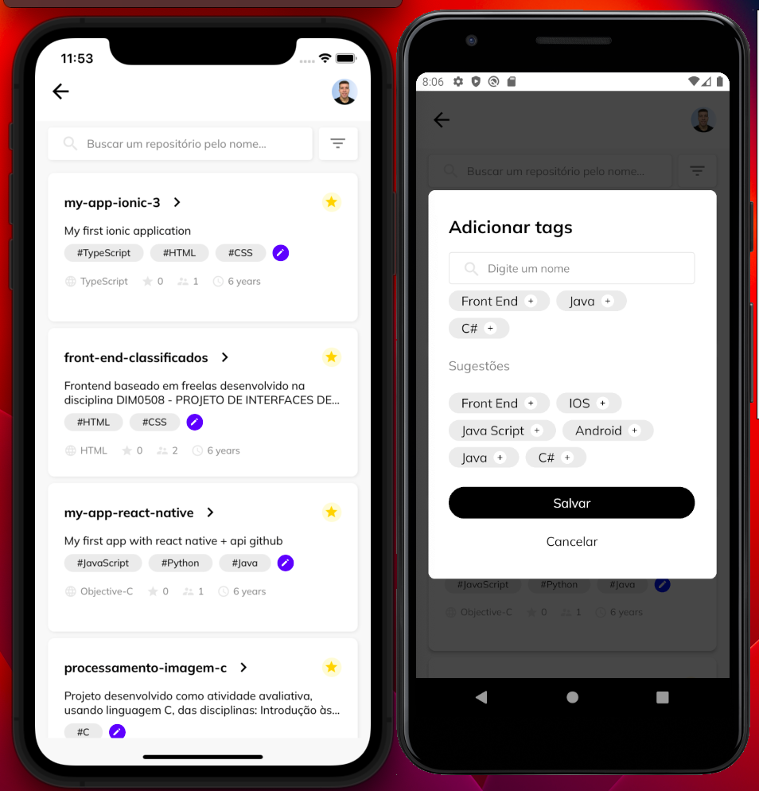

# Gitbub App
This project lists users and repositories from github public API. It was developed using React Native, GraphQL, Styeld-component and Typescript. Also it was created automated tests using jest and detox also error tracking with Sentry.

## Preview
 

## Getting Started


>**Note**: Make sure you have completed the [React Native - Environment Setup](https://reactnative.dev/docs/environment-setup) instructions till "Creating a new application" step, before proceeding.

>**Version**: Node 20, Java 17

### Step 1: Installing dependencies

First, you will need to install the dependencies of the project.

```bash
# using npm
npm install 

# OR using Yarn
yarn install
```

### Step 2: Installing React Native dependencies

First, you will need to install the dependencies of the project.

```bash
# using npm
npm install 

# OR using Yarn
yarn install
```
### Step 3: Installing IOS dependencies

Second, you will need to install the native dependencies of the project.

```bash
# accessing ios/
cd ios/ 

# install dependencies
pod install

# going back to root
cd ..
```

### Step 4: Start your Application

Start Metro Bundlerin a terminal and in another terminal run the follow commands depending on your OS.

### For Android

```bash
# using npm
npm run android

# OR using Yarn
yarn android
```

### For iOS

```bash
# using npm
npm run ios

# OR using Yarn
yarn ios
```

If everything ran correctly, you will have the app running in a Simulator (IOS) or in a Emulator (Android) after some minutes.


## How to run automated tests?

### - Running component tests (Jest)

You can run the suit of tests using the commands below:

```bash
# using npm
npm test 

# OR using Yarn
yarn test
```

### - Running e2e tests (Detox)

First of all, you will need to have the detox cli configurated and then you will need generate a Android and IOS build to be able to run the tests.

```bash
# generating a Android build
detox build --configuration android.emu.release

# generating a IOS build
detox build --configuration ios.sim.debug
```
After the build generated, you will need to run the tests.

```bash
# running Android e2e tests
detox test --configuration android.emu.debug

# running IOS e2e tests
detox test --configuration ios.sim.debug 

```
If no errors showed up, you will see the emulator/simulator opening and running the e2e tests.
